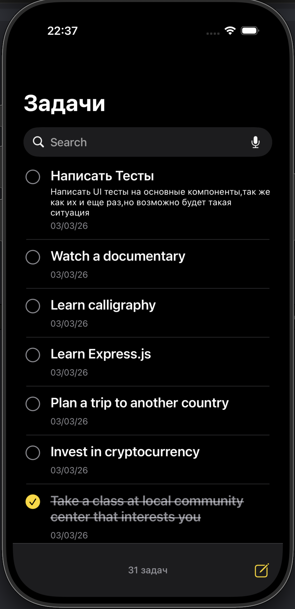
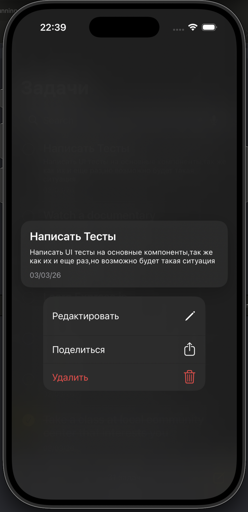
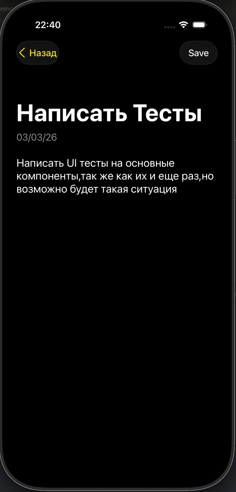

# ToDoList

Простое приложение списка задач.

## Скриншоты

  

## Основные возможности

- просмотр списка задач
- создание задачи
- редактирование задачи
- удаление задачи
- поиск по задачам
- хранение данных в **CoreData**
- первичная загрузка задач из API

## Архитектура

Используется архитектура **VIPER**.

Модули разделены на:

- View — отображение
- Presenter — логика представления
- Interactor — бизнес‑логика
- Router — навигация

## Стек

- Swift
- UIKit
- CoreData
- GCD (background операции)
- XCTest

## Тесты

Покрыты основные компоненты:

- `TodoListPresenterTests`
- `TodoEditorPresenterTests`
- `CDTodoMappingTests`

Проверяется:

- взаимодействие Presenter ↔ Interactor
- навигация через Router
- маппинг моделей

## Запуск

1. Открыть проект в Xcode
2. Собрать и запустить
3. Тесты: `Cmd + U`
